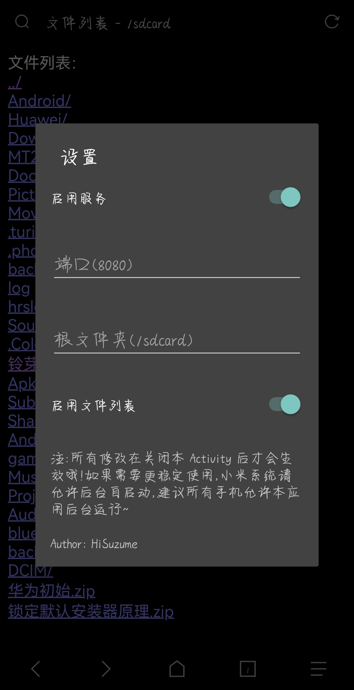

### Android Httpd

一个基于 [NanoHttpd](https://github.com/NanoHttpd/nanohttpd/) 的静态网页服务软件，适用于前端的离线调试、前后端分离等。

#### 预览

#### 编译

本项目使用 [CodeAssist](https://github.com/tyron12233/CodeAssist/) 进行开发，理论上其他 IDE 也能直接编译。

如果使用其他 IDE 且无法打开，我也无能为力，实在抱歉！

#### 授权

**注：本项目使用 MIT License 开源，但我不建议将本项目用于商业用途。**

[NanoHttpd](https://github.com/NanoHttpd/nanohttpd/) - BSD-3-Clause license
